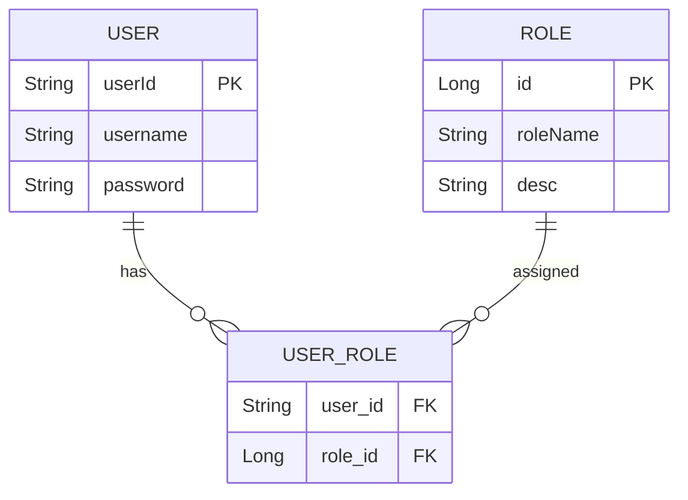

#  Système de Gestion des Utilisateurs et Rôles (JPA Many-To-Many)


##  Table des matières
- [Fonctionnalités](#-fonctionnalités)
- [Structure du projet](#-structure-du-projet)
- [Modèle de données](#-modèle-de-données)
- [Installation](#-installation)
- [API Endpoints](#-api-endpoints)
- [Analyse des Composants](#-analyse-des-composants)
- [Configuration](#-configuration)
- [Captures d'écran](#-captures-décran)

##  Fonctionnalités

  Ce système Spring Boot gère des utilisateurs et leurs rôles avec une relation Many-to-Many. Il offre :
  - Une relation Many-to-Many bien implémentée
  - La séparation des couches Spring Boot
  - Les bonnes pratiques JPA/Hibernate
  - **Gestion des utilisateurs** (CRUD complet)
  - **Gestion des rôles** (STUDENT, USER, ADMIN)
  - **Relation Many-To-Many** entre utilisateurs et rôles
  - **Authentification simple**
  - **API REST** pour l'intégration frontend


##  Structure du projet

```
jpamtom/
├── src/
│   ├── main/
│   │   ├── java/
│   │   │   └── org/example/jpamtom/
│   │   │       ├── entities/       # Entités JPA
│   │   │       ├── repositories/   # Spring Data JPA
│   │   │       ├── service/        # Logique métier
│   │   │       ├── web/           # Contrôleurs REST
│   │   │       └── JpaMtoMApplication.java
│   │   └── resources/
│   │       └── application.properties
└── pom.xml
```

##  Modèle de données



##  Installation

1. **Prérequis** :
   - Java 21
   - MySQL 
   - Maven 
   - Spring Boot
   - JPA hibernate
   - H2 database

2. **Configurer la base de données** :
   ```sql
   CREATE DATABASE USERS_DB;
   ```


4. **Données initiales** :
   - 2 utilisateurs (`user1`, `user2`)
   - 3 rôles (`STUDENT`, `USER`, `ADMIN`)
   - Associations :
     - user1: STUDENT, USER
     - user2: USER, ADMIN

##  API Endpoints

| Méthode | Endpoint                | Description                |
|---------|-------------------------|----------------------------|
| GET     | `/users/{username}`     | Récupère un utilisateur    |

##  **Analyse des Composants**

### 1.  **Couche Entités (JPA)**
#### `User.java`
```java
@Entity
@Table(name="USERS")
public class User {
    @Id
    private String userId;  // UUID généré automatiquement
    
    @Column(unique = true, length = 20)
    private String username;
    
    @JsonProperty(access = WRITE_ONLY) // Masqué en JSON
    private String password;
    
    @ManyToMany(mappedBy = "users", fetch = EAGER)
    private List<Role> roles; 
}
```
**Responsabilité** : Modélise un utilisateur avec :
- Un identifiant unique
- Des credentials de connexion
- Une collection de rôles (chargés immédiatement)

#### `Role.java`
```java
@Entity
public class Role {
    @Id @GeneratedValue
    private Long id;
    
    @Column(unique = true, length = 20)
    private String roleName;  // "ADMIN", "USER" etc.
    
    @ManyToMany(fetch = EAGER)
    @JsonProperty(access = WRITE_ONLY)
    private List<User> users;
}
```
**Responsabilité** : Définit un rôle applicatif avec :
- Un nom unique
- La liste des utilisateurs associés

### 2.  **Couche Repository**
#### `UserRepository.java`
```java
public interface UserRepository extends JpaRepository<User, String> {
    User findByUsername(String username); // Requête dérivée
}
```
**Fonctionnalités** :
- Hérite des méthodes CRUD de base
- Implémente une recherche par username

#### `RoleRepository.java`
```java
public interface RoleRepository extends JpaRepository<Role, Long> {
    Role findByRoleName(String roleName);
}
```
**Particularité** : Trouve un rôle par son nom (ex: "ADMIN")

### 3.  **Couche Service**
#### `UserServiceImpl.java`
```java
@Service
@Transactional
public class UserServiceImpl implements UserService {
    
    public void addRoleToUser(String username, String roleName) {
        User user = userRepository.findByUsername(username);
        Role role = roleRepository.findByRoleName(roleName);
        
        user.getRoles().add(role);  // Bidirectionnel
        role.getUsers().add(user);  // Maintient la cohérence
    }
    
    public User authenticate(String username, String password) {
        User user = userRepository.findByUsername(username);
        if(user == null || !user.getPassword().equals(password)) {
            throw new RuntimeException("Authentification échouée");
        }
        return user;
    }
}
```

**Points clés** :
- Gère la logique métier
- Assure la cohérence des relations
- Contrôle d'accès basique

### 4.  **Couche Web**
#### `UserController.java`
```java
@RestController
public class UserController {
    
    @GetMapping("/users/{username}")
    public User getUser(@PathVariable String username) {
        return userService.findUserByUserName(username);
    }
}
```
**Caractéristiques** :
- Exposition REST simple
- Sérialisation JSON automatique
- Routes basiques

##  Configuration

### Fichier `application.properties`
```properties
spring.datasource.url=jdbc:mysql://localhost:3306/USERS_DB
spring.datasource.username=root
spring.datasource.password=

spring.jpa.hibernate.ddl-auto=update
spring.jpa.show-sql=true
```

### Dépendances principales (`pom.xml`)
```xml
<dependencies>
    <dependency>
        <groupId>org.springframework.boot</groupId>
        <artifactId>spring-boot-starter-data-jpa</artifactId>
    </dependency>
    <dependency>
        <groupId>mysql</groupId>
        <artifactId>mysql-connector-java</artifactId>
    </dependency>
    <dependency>
        <groupId>org.projectlombok</groupId>
        <artifactId>lombok</artifactId>
    </dependency>
</dependencies>
```

##  **Flux Typique**

1. **Initialisation** (`CommandLineRunner`)
```java
userService.addNewUser(new User("admin", "pass"));
userService.addNewRole(new Role("ADMIN"));
userService.addRoleToUser("admin", "ADMIN");
```

2. **Requête API**
```
GET /users/admin → 200 OK
{
  "userId": "abc123",
  "username": "admin",
  "roles": [{"roleName": "ADMIN"}]
}
```

3. **Authentification**
```java
User user = userService.authenticate("admin", "pass");
```

##  **Sécurité Implémentée**

| Mécanisme | Implémentation | Exemple |
|-----------|----------------|---------|
| Masquage passwords | `@JsonProperty(access = WRITE_ONLY)` | `password` non visible dans les réponses |
| Contrôle accès | Méthode `authenticate()` | Vérifie username/password |
| Unicité | Contraintes `@Column(unique=true)` | Empêche les doublons de noms |


##  Captures d'écran

### 1. Structure des tables MySQL


### 2. Données des utilisateurs


### 3. Données des rôles


### 4. Table de jointure (gérée automatiquement)


### 5. Exemple de réponse API


